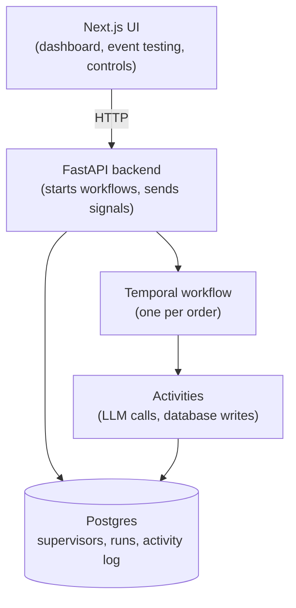
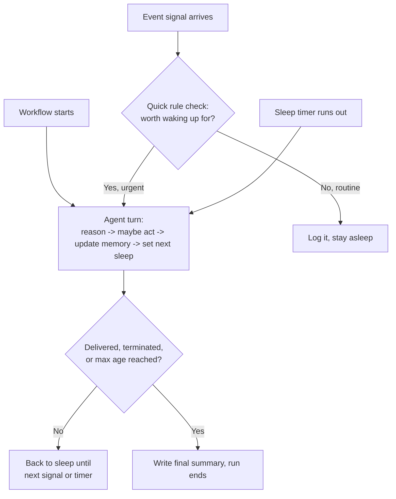
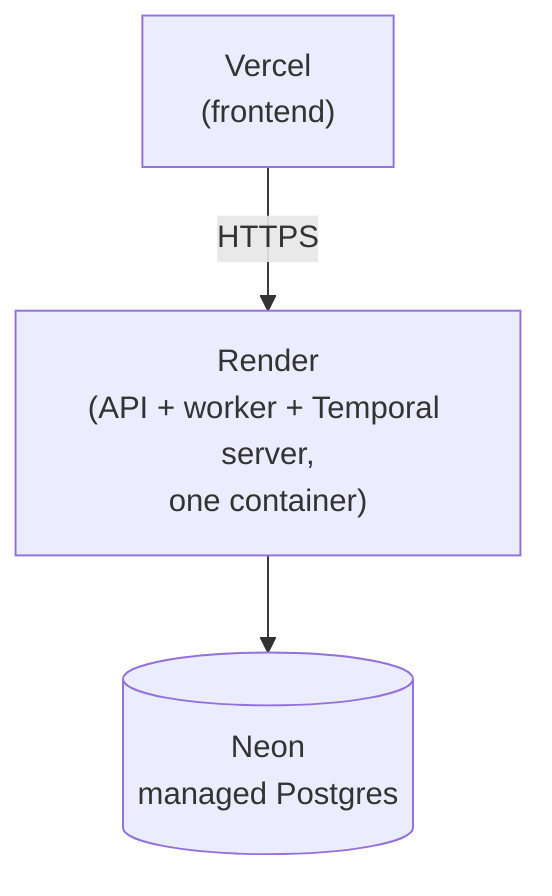

# Architecture — AI Order Supervisor

## Overview

Each order gets its own background process (a Temporal workflow) that lives from creation to
completion. It does nothing until there's a real reason to act — no polling, no fixed check-in
loop.

**Stack:** Next.js frontend, FastAPI backend, one Temporal workflow per order, Groq's
`openai/gpt-oss-120b` for the LLM reasoning, PostgreSQL (Neon in production) for storage.

## System Design

- **Frontend (Next.js + Tailwind):** set up supervisors, start runs, send test events, add
  instructions, pause/resume/terminate a run, watch its timeline and memory update.
- **Backend (FastAPI):** thin layer between the frontend and everything else — starts workflows,
  passes events into them, sends run/timeline data back to the UI.
- **Temporal workflow:** one per order. Holds the run's state (memory, next wake-up time, paused
  or not) and decides *when* the agent should think. Never talks to the LLM or database directly.
- **The agent (Groq's `openai/gpt-oss-120b`, called inside an activity named `run_agent_turn`):**
  reads recent history, asks the LLM what to do, gets back a decision — actions to take, an
  updated memory summary, how long to sleep.
- **Database (PostgreSQL, Neon in production):** three tables — `supervisors`, `runs`,
  `activity_log`. Every event, sleep decision, action, instruction, and final summary is one row
  in `activity_log`.

## How a Decision Gets Made

All three triggers (start, signal, timer) feed the same agent turn. The only branch that skips it
is a routine event that the rule check decides isn't worth an LLM call.

**Events are queued, not handled inline.** The `order_event` signal handler itself does nothing
but append the event to an in-memory list and mark that a signal arrived — it has no `await` in
it, so it always finishes instantly. The single `run()` loop is the only place that actually reads
that list and processes events, one at a time: rule check, then (if needed) agent turn, dispatch,
memory update, and sleep decision, fully finishing for one event before starting the next. Two
events arriving back-to-back can never trigger two overlapping agent turns or race each other's
sleep-timer writes — everything about "what does the agent do next" runs through one place,
serially.

## Reliability Details

A few things make repeated or overlapping activity execution safe, which matters once retries and
concurrent signals are in the picture:

- **Every database write from an activity is idempotent.** The row's id is minted in the
  workflow with `workflow.uuid4()` (a deterministic, replay-safe UUID generator built into the
  Temporal SDK for exactly this) and passed into the activity, instead of the activity generating
  its own id. If an activity gets retried after its write already landed, it reuses the same id
  and the database `INSERT ... ON CONFLICT DO NOTHING`s instead of writing a second row.
- **The workflow waits for in-flight signal handlers before closing.** `terminate` or a
  `delivered` event can complete the run while a slower handler (`interrupt`, `resume`,
  `add_instruction`) is still mid-activity. Right before writing the final summary, the workflow
  calls `workflow.wait_condition(workflow.all_handlers_finished)` so that handler's write always
  lands before the run is marked closed.
- **A Groq outage degrades the run instead of killing it.** If `run_agent_turn` still fails after
  its 3 retries, the workflow catches that, writes an internal note explaining what happened, and
  schedules a retry 30 minutes later — rather than letting the whole order's supervision die
  permanently on a transient LLM error.

## What Wakes the Workflow Up

Only three things:

1. **It just started** — the agent makes its first decision the moment a run is created.
2. **An event came in** — payment failed, shipment delayed, customer message, etc.
3. **A timer ran out** — the agent's own last "check back in X hours" decision came due.

## Signals This Workflow Listens For

Everything from the outside reaches a running workflow through one of these five signals —
there's no other way in once a run has started:

- **`order_event`** — a business event on the order (e.g. `payment_failed`, `shipment_delayed`).
  Goes through the rule check above before anything else happens.
- **`terminate`** — ends the run early and writes the final summary right away.
- **`interrupt`** — pauses the run; it stops reacting to anything until resumed.
- **`resume`** — un-pauses a run that was interrupted.
- **`add_instruction`** — attaches a manual instruction (e.g. "don't contact the customer without
  review") that the agent picks up on its next turn.

Each one maps to a single API endpoint (`/events`, `/terminate`, `/interrupt`, `/resume`,
`/instructions`), so the UI only ever talks to the backend — never to Temporal directly.

## What Makes a Run End

Only three fixed rules — never the LLM's own opinion:

- the order was marked delivered
- someone terminated the run from the dashboard
- the run hit a max age (72 hours)

The agent can say "I think this is done," but that alone changes nothing. An ending that follows
fixed rules is easier to trust and explain than one left to a model's judgment.

## Deciding What's Worth Waking Up For

A quick rule check (`classify_event`) runs before the LLM ever gets involved:

- **Clearly urgent** (payment failed, shipment delayed, refund requested, customer message) →
  always wakes the agent.
- **Routine** (order created, payment confirmed, shipment created) → just logged, stays asleep —
  unless the supervisor is set to a more sensitive mode.
- **Unrecognized** → wakes the agent anyway, so nothing unusual slips through silently.

This keeps LLM calls low. The agent can also update its own "wake me up for this" list after each
turn, so the check gets smarter about that specific order over time.

## Memory, Not a Full Transcript

- One short memory summary per run, rewritten by the agent every time it acts.
- Each turn also gets the 15 most recent activity log entries and any manual instructions.
- Keeps enough context without sending the full run history to the LLM every time.

## The Business Actions

Five actions the agent can take: message fulfillment, message payments, message logistics,
message the customer, or leave an internal note. Each one just writes a row to the activity log —
nothing is actually sent to a real system. That's intentional for this project's scope.

## Deployment

- **Frontend — Vercel.** `NEXT_PUBLIC_API_URL` points at the Render backend. Without it set
  correctly, nothing loads — the frontend has no backend of its own.
- **Backend — Render.** One free web service runs the Temporal server, the Temporal worker, and
  FastAPI together — Render's free tier only covers one service, so running them separately would
  cost extra. Needs `DATABASE_URL`, `GROQ_API_KEY`, and `FRONTEND_ORIGINS` set.
- **Database — Neon.** Chosen over Render's own free database, which gets deleted 30 days after
  creation. Neon's free tier doesn't expire.
- **No managed Temporal service:** Temporal Cloud starts at $100/month, so this project runs its
  own small Temporal server inside the free Render container instead.
- **The trade-off:** the Temporal server's state lives in a file inside the container. Render's
  free tier wipes that file on restart, so a sleeping run loses its live workflow when that
  happens (the run's history in the database is fine — only further actions on that run stop
  working). See [`KNOWN_ISSUES.md`](KNOWN_ISSUES.md) for details and what would fix it properly.

## What's Deliberately Left Out

This is a proof-of-concept, so a few things are left out on purpose:

- Real messaging or commerce integrations — actions just get logged, nothing is actually sent.
- User accounts, authentication, or multiple separate businesses.
- Trimming a run's history for extremely long-running orders (`continue_as_new` in Temporal
  terms) — the rolling memory summary already covers this project's scope. Concretely: a run is
  capped at 72 hours and typically wakes at most once or twice an hour, each wake-up adding a
  handful of activity-log rows and one workflow history event — nowhere near Temporal's workflow
  history size limits at this scale, so `continue_as_new` isn't needed here.
- Analytics beyond the run list and filters already in the dashboard.
- A separate "pause" button — pause and interrupt do the same thing here, so they're one signal.

Listed here so it's clear these were left out on purpose, not missed.
