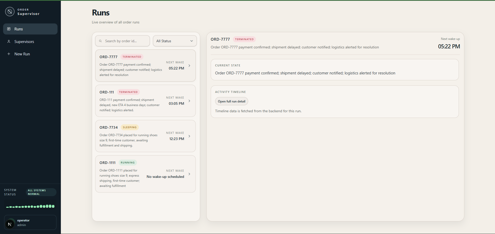
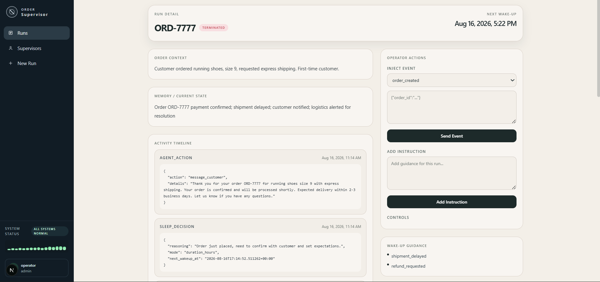
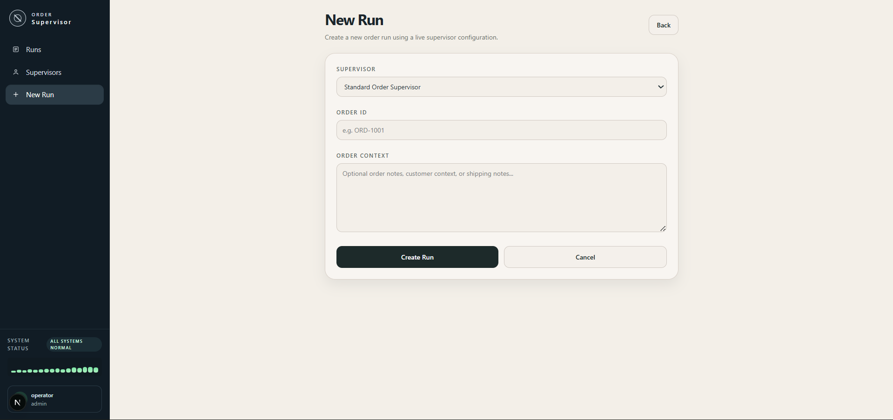
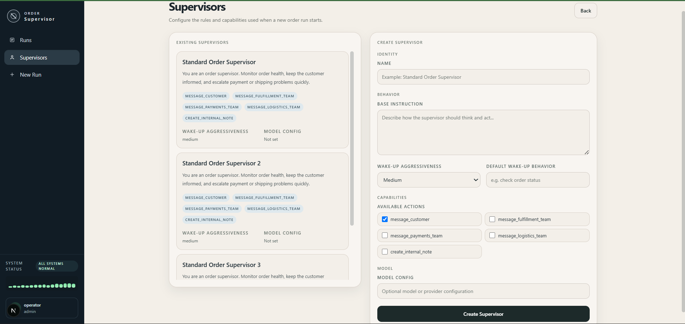
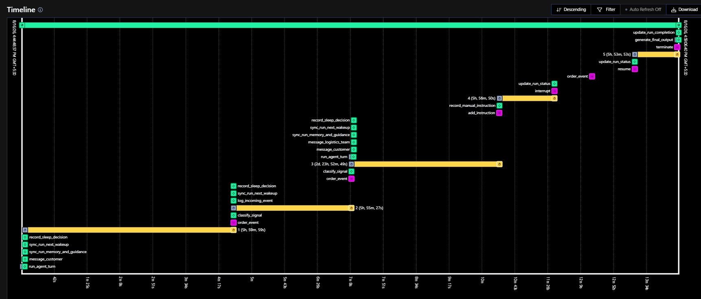
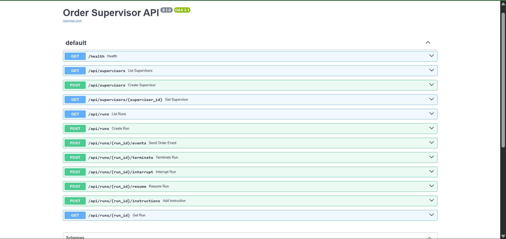

Watch the Walkthrough: [Walkthrough_Video](https://drive.google.com/file/d/11IHDUhzt7J8GTvUGrAVLawDK8ght8jN3/view?usp=sharing) 

# Order Supervisor

An AI agent that supervises a single order from creation to completion —
waking up only when there's something to act on, and sleeping otherwise
rather than polling continuously.

Built as a proof-of-concept take-home assignment.

---

## What It Does

Traditional order monitoring requires either continuous human oversight or a
script polling the database on a fixed interval — both spend resources on
checks that usually find nothing has changed.

Instead, this project starts one durable background process (a **Temporal
workflow**) per order. That process:

1. **Wakes up** when the order is created, when something relevant happens
   (payment confirmed, shipment delayed, customer message, etc.), or when a
   timer it set for itself fires.
2. **Decides what to do** by asking an LLM (via Groq) — should it message the
   customer, alert logistics, just make a note, or do nothing?
3. **Goes back to sleep**, either for a fixed number of hours or "until
   something happens," and tells the system exactly what would be worth
   waking it up early for.
4. Keeps a **memory summary** and a full **timeline** of everything it saw and
   did, so it's never starting from scratch when it wakes up.
5. Eventually **finishes** — because the order was delivered, someone
   terminated it from the UI, or it simply got too old — and writes a final
   report: what it did, what it learned, and what it'd recommend next time.

Not every event needs to wake the full LLM. A lightweight rule-based
**classifier** checks each incoming event first: routine, expected events
are logged quietly, and only events that matter wake the reasoning agent.

## Architecture

```
┌──────────────┐        HTTP         ┌──────────────┐      Temporal signals     ┌──────────────────────┐
│   Frontend   │ ──────────────────▶ │   Backend    │ ────────────────────────▶ │   Temporal Workflow   │
│ (Next.js UI) │ ◀────────────────── │  (FastAPI)   │ ◀──────────────────────── │  (one per order)      │
└──────────────┘      JSON           └──────┬───────┘                          └──────────┬────────────┘
                                             │                                             │
                                             ▼                                             ▼
                                      ┌─────────────┐                            ┌──────────────────┐
                                      │  PostgreSQL │ ◀───── activity log ────── │  Groq LLM calls   │
                                      │ (Docker)    │        & run state         │  (agent reasoning) │
                                      └─────────────┘                            └──────────────────┘
```

- **Frontend (Next.js)** — create supervisor configs, start runs, inject
  events, add live instructions, pause/resume/terminate, and watch the
  timeline and memory update in real time.
- **Backend (FastAPI)** — a thin HTTP layer that starts workflows, forwards
  events into them as Temporal signals, and reads/writes run state to
  Postgres.
- **Temporal workflow** — controls when the agent runs. It never runs a
  tight loop; it sleeps (via `workflow.wait_condition` with a timeout) until
  a signal arrives or its own wake-up timer fires, then hands off to an
  activity that calls the LLM.
- **Classifier** (`classify_signal`) — a fast, rule-based check that decides
  whether an incoming event is worth waking the full agent for, or can just
  be logged and left for the next scheduled wake-up.
- **Agent activities** (Groq, model `openai/gpt-oss-120b`) — reason about the
  order's current state and decide: which of the 5 business actions to take
  (if any), what to put in the memory summary, and how long to sleep for.
- **PostgreSQL** — stores supervisor configs, runs, and a single activity log
  table covering incoming events, sleep/wake decisions, agent actions,
  manual instructions, and final output.

The 5 business actions (`message_fulfillment_team`, `message_payments_team`,
`message_logistics_team`, `message_customer`, `create_internal_note`) don't
send anything externally — per the assignment scope, each one just writes an
activity record that shows up in the run's timeline.

## Screenshots

**Runs dashboard** — every run at a glance, with status and next wake-up time.


**Run detail** — order context, live memory, activity timeline, and controls
to inject events or instructions.


**Starting a new run** — pick a supervisor config, give it an order ID and
context.


**Supervisor configuration** — define name, base instruction, allowed
actions, and how aggressively it should wake up.


**Temporal Web UI** — the actual workflow execution history: every signal,
activity, and timer, with real wall-clock durations between wake-ups.


**Backend API docs** — auto-generated FastAPI/Swagger docs for every
endpoint.


## Stack

| Layer | Technology |
|---|---|
| Frontend | Next.js (App Router) + Tailwind CSS |
| Backend | Python + FastAPI |
| Orchestration | Temporal (Python SDK, `temporalio`) |
| Database | PostgreSQL (via Docker) |
| LLM | Groq, model `openai/gpt-oss-120b` |

## Running it locally

Four processes run at once: Postgres, a Temporal dev server, the backend
worker + API, and the frontend. Each step below is a single command run in
its own terminal.

**Prerequisites** — install these first:
- [Docker Desktop](https://www.docker.com/products/docker-desktop/) (runs Postgres — you don't configure Postgres by hand, Docker does it via `docker-compose.yml`)
- [Node.js](https://nodejs.org/) 18+ (frontend)
- Python 3.11+ (backend)
- [Temporal CLI](https://docs.temporal.io/cli#install) (local workflow engine)
- A free [Groq API key](https://console.groq.com/keys) (LLM calls)

### 1. Get a Groq API key
Create `backend/.env` (this file is git-ignored, so your key never gets
committed):
```env
GROQ_API_KEY=your_groq_key_here
```

### 2. Start Postgres
From the project root:
```bash
docker compose up -d
```
This runs Postgres on port `5433` with a Docker-managed volume — nothing to
set up by hand.

### 3. Create the database tables
```bash
cd backend
python -m venv .venv

# Windows
.\.venv\Scripts\activate
# macOS / Linux
source .venv/bin/activate

pip install -r requirements.txt
python -m scripts.init_db
```
This creates the `supervisors`, `runs`, and `activity_log` tables. Safe to
re-run — it won't drop existing data.

### 4. Start the Temporal dev server
In a **new terminal**:
```bash
temporal server start-dev --db-filename temporaldata
```
> This writes a local `temporaldata` file for Temporal's own state. It's
> git-ignored on purpose — it's a runtime artifact, not something to commit.

### 5. Start the backend worker and API
Back in the `backend` terminal from step 3 (venv still active):
```bash
python -m app.worker
```
Then, in **another new terminal**:
```bash
cd backend
source .venv/bin/activate   # or .\.venv\Scripts\activate on Windows
python -m uvicorn app.main:app --reload --host 0.0.0.0 --port 8000
```
API docs will be at http://localhost:8000/docs

### 6. Start the frontend
In one more terminal, from the **project root**:
```bash
npm install
npm run dev
```
Open http://localhost:3000

By default the frontend talks to `http://localhost:8000`. If you ever run
the backend somewhere else, set `NEXT_PUBLIC_API_URL` (see `.env.example`).

## Deployment

This project has three backend components that need to run continuously:
Postgres, a Temporal server, and a Python worker connected to Temporal.
Hosting all three on free infrastructure reliably is not practical — Temporal
in particular has no permanent free managed offering (see below). The
approach below deploys the frontend only, which is sufficient for a public,
shareable link to the UI and code.

### Deploy the frontend to Vercel (free, ~10 minutes)

This produces a public URL for the UI and source code. See the limitation
noted below regarding backend connectivity.

1. Push this repo to GitHub if it isn't already there.
2. Go to [vercel.com](https://ai-order-supervisor.vercel.app/) and sign up/log in with GitHub.
3. Click **Add New → Project**, and import this repository.
4. Vercel auto-detects Next.js — leave the build settings as default.
5. Before deploying, add an environment variable:
   - **Key:** `NEXT_PUBLIC_API_URL`
   - **Value:** the public URL of your backend (see limitation below)
6. Click **Deploy**. You'll get a URL like `https://order-supervisor.vercel.app`.
7. Paste that URL into the placeholder at the top of this section.

**Limitation:** the frontend has no backend of its own — it only calls the
FastAPI server. If `NEXT_PUBLIC_API_URL` points at nothing reachable (e.g.
it's left as `localhost:8000`), the pages will load but every action
(viewing runs, creating a run, etc.) will fail, since the browser is trying
to reach a server that only exists on the local machine.

### Deploying the backend as well (optional)

- **Postgres:** [Neon](https://neon.tech) offers a free tier suitable for
  this project.
- **FastAPI + worker:** [Render](https://render.com) free web services work,
  but sleep after inactivity and cold-start slowly — acceptable for an
  occasional demo, not for an always-on service.
- **Temporal:** the primary constraint. Temporal Cloud has no permanent free
  tier, and reliably self-hosting a Temporal server on free infrastructure is
  beyond the scope of this project. Temporal and the worker are intended to
  run locally; a fully public, always-on backend is out of scope for a free
  deployment.

**Live frontend:** [Just a Skeleton since the backend require local environment](https://ai-order-supervisor.vercel.app/)

## Project structure

```
.
├── src/                  # Next.js frontend (App Router)
│   ├── app/
│   │   ├── page.tsx          # Runs dashboard
│   │   ├── new-run/          # Start a new run
│   │   ├── runs/[run_id]/    # Run detail, timeline, controls
│   │   └── supervisors/      # Supervisor configuration
│   └── lib/
│       ├── api.ts            # Backend base URL (env-configurable)
│       └── format-time.ts
├── backend/
│   ├── app/
│   │   ├── main.py           # FastAPI routes
│   │   ├── workflow.py       # Temporal workflow definition
│   │   ├── activities.py     # LLM calls, classifier, business actions
│   │   ├── temporal_client.py
│   │   └── worker.py         # Temporal worker process
│   └── scripts/
│       ├── init_db.py        # Creates DB tables
│       └── seed_demo.py
├── docker-compose.yml    # Postgres
└── screenshots/
```

## Current state

Working end-to-end: one Temporal workflow per order, signal-driven wake-ups,
scheduled wake-ups, the 5 business actions logged as activity records, a live
memory summary and timeline in the UI, run interrupt/resume/terminate, and a
generated final summary with learnings and feedback on completion.

Explicitly out of scope: real external messaging/commerce integrations,
authentication, multi-tenant hardening, and production-grade polish. This is
a POC focused on clean architecture and a reliable local demo, not a
shippable product.
