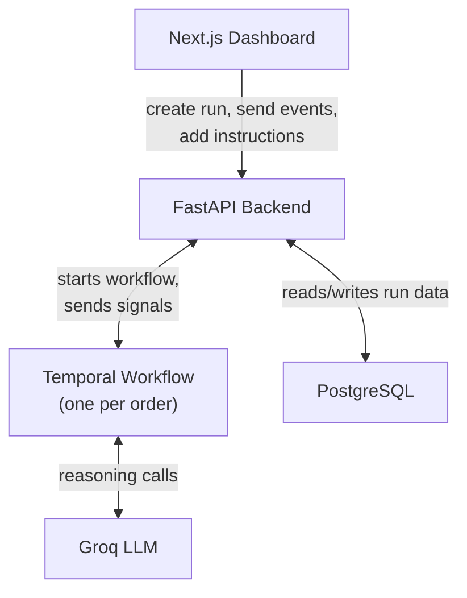
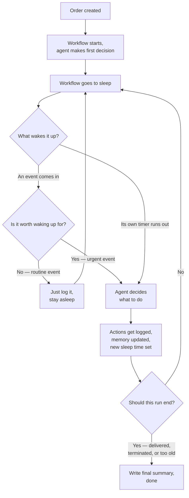

# AI Order Supervisor

Most order-tracking systems either need a person watching them all the time, or a script that
checks the database every few minutes whether anything happened or not. I built this to try a
different approach: one background process per order that stays asleep until something actually
needs its attention, then wakes up, thinks, acts, and goes back to sleep.

**🔗 Live app:** [FrontEnd](https://ai-order-supervisor.vercel.app/)
**🔗 Backend health check:** [BackEnd][https://order-supervisor-backend-mrpj.onrender.com/health]

> Wake the backend before using the app. It's hosted on a free service that goes to sleep after
> a while of no traffic — open the health check link above first and wait for it to respond, then
> use the live app link. The first request can take 30-60 seconds; everything after that is fast.

[](https://www.python.org/)
[](https://fastapi.tiangolo.com/)
[](https://nextjs.org/)
[](https://temporal.io/)
[](https://neon.tech/)
[](LICENSE)

---

## Problem Statement

Keeping track of an order after it's placed usually comes down to two options, and both waste
effort:

- **A person checks in on it by hand** — someone has to babysit an order that's just sitting there.
- **A script polls the database on a timer** — asking "anything new?" every few minutes, almost
  always getting "no."

What I wanted instead: something that stays quiet when there's nothing to do, and jumps in the
moment something actually needs a decision.

## My Solution

Every order gets its own background process (a **Temporal workflow**) the moment it's created.
It just waits — no loop, no polling — until:

- **Something happens to the order** — payment fails, shipment delayed, customer message — an
  event gets pushed to it.
- **Its own timer runs out** — after acting, it sets a "check back in X hours" timer and sleeps.

When it wakes up, an LLM (via Groq) decides what to do — message a team, message the customer,
make a note, or nothing — then it sleeps again.

A few choices worth explaining:
- **A rule-based check runs before the LLM ever gets involved.** Routine events (like "payment
  confirmed") get logged and the process stays asleep. Only events that are actually worth
  reacting to wake the LLM up. This keeps the number of LLM calls low.
- **The LLM never decides when a run is fully over.** It can act, and it can note "I think this
  order is done," but only three fixed rules can actually end a run: the order was delivered, a
  person terminated it from the dashboard, or it hit a maximum age limit. This keeps endings
  predictable instead of leaving it up to the model's judgment.
- **One rolling memory summary, not a full transcript.** Each run keeps a short, current summary
  of what's going on, rewritten by the agent every time it acts, instead of sending its entire
  history to the LLM every single time.



## How It Works



- **Step E** is what keeps this efficient — most events never reach the LLM at all.
- **Step I** only ever checks the three fixed rules, never what the LLM itself thinks.

## Tech Stack

| Tool | Role | Why |
|---|---|---|
| Temporal (Python SDK) | Runs one background process per order | Built exactly for "stay alive, sleep, wake on a signal or timer" — no need to hand-roll that |
| FastAPI | Backend API | Fast to build with, and pairs naturally with Temporal's Python SDK |
| Groq (`openai/gpt-oss-120b`) | The agent's reasoning | Fast responses, generous free tier for a project that calls it a lot while testing |
| PostgreSQL (Neon in production) | Stores runs, supervisors, and the activity log | Neon's free tier doesn't expire like some others do |
| Next.js + Tailwind CSS | Frontend dashboard | Fast to build a clean UI with, good fit for a small one-person project |
| Render | Hosts the backend | Free web service tier, runs the API, the Temporal worker, and the Temporal server together |
| Vercel | Hosts the frontend | Zero-config Next.js deployment |

## Key Features

- One background process per order — no polling, no wasted checks.
- A quick rule-based check decides if an event is worth waking the LLM up for.
- Five actions the agent can take: message fulfillment, message payments, message logistics,
  message the customer, or leave an internal note.
- A live activity timeline for every run, newest update on top.
- Add a manual instruction to a run at any time, and the agent takes it into account next time it
  acts.
- Pause (interrupt) and resume a run without ending it.
- Terminate a run early and get a written final summary: what happened, what was learned, and
  feedback.
- A rolling memory summary per run, so the agent always has context without needing a full
  transcript.

## Folder Structure

```
order-supervisor/
├── src/                       # Next.js frontend
│   ├── app/
│   │   ├── page.tsx               # Runs dashboard
│   │   ├── new-run/                # Start a new run
│   │   ├── runs/[run_id]/          # Run detail: timeline, memory, controls
│   │   └── supervisors/            # Create and view supervisor configs
│   └── lib/
│       ├── api.ts                  # Backend URL config
│       └── format-time.ts          # Shared timestamp formatting
├── backend/
│   ├── app/
│   │   ├── main.py                 # FastAPI routes
│   │   ├── workflow.py             # The Temporal workflow itself
│   │   ├── activities.py           # LLM calls, the rule-based check, business actions
│   │   ├── temporal_client.py      # Talks to the Temporal server
│   │   ├── worker.py               # Runs the workflow/activities
│   │   └── db.py                   # Database models and connection
│   ├── scripts/
│   │   ├── init_db.py              # Creates the database tables
│   │   └── seed_demo.py            # Quick manual test script
│   ├── Dockerfile
│   └── start.sh                    # Starts all three backend processes together
├── docker-compose.yml          # Local Postgres for development
├── render.yaml                 # Render deployment config
├── ARCHITECTURE.md             # A closer look at how it's all put together
├── KNOWN_ISSUES.md             # Current limitations, explained
└── screenshots/
```

## Running This Locally

Four things run at once: Postgres, a Temporal server, the backend, and the frontend. Each step
below is one command in its own terminal.

**Install first:**
- [Docker Desktop](https://www.docker.com/products/docker-desktop/) — runs Postgres for you
- [Node.js](https://nodejs.org/) 18+
- Python 3.11+
- [Temporal CLI](https://docs.temporal.io/cli#install)
- A free [Groq API key](https://console.groq.com/keys)

**1. Set your Groq key**

Create `backend/.env` (already git-ignored):
```env
GROQ_API_KEY=your_groq_key_here
```

**2. Start Postgres**
```bash
docker compose up -d
```

**3. Create the database tables**
```bash
cd backend
python -m venv .venv
source .venv/bin/activate   # Windows: .venv\Scripts\activate
pip install -r requirements.txt
python -m scripts.init_db
```

**4. Start the Temporal server** (new terminal)
```bash
temporal server start-dev --db-filename temporaldata
```

**5. Start the backend worker** (back in the backend terminal)
```bash
python -m app.worker
```

**6. Start the backend API** (another new terminal)
```bash
cd backend
source .venv/bin/activate
python -m uvicorn app.main:app --reload --host 0.0.0.0 --port 8000
```
API docs: http://localhost:8000/docs

**7. Start the frontend** (another new terminal, from the project root)
```bash
npm install
npm run dev
```
Open http://localhost:3000

The frontend talks to `http://localhost:8000` by default. To point it somewhere else, set
`NEXT_PUBLIC_API_URL` (see `.env.example`).

## Known Limitations

- **A backend restart can lose a run's live state.** The free hosting plan restarts the backend
  after periods of no traffic, which wipes the in-progress workflow for any run that was sleeping
  at the time. The run's history stays visible — only further actions on that specific run stop
  working. Full explanation and options in [`KNOWN_ISSUES.md`](KNOWN_ISSUES.md).
- **Free-tier cold starts.** The backend sleeps when idle, so the first request after a while can
  take 30-60 seconds. Hit `/health` first if it's been sitting unused.
- **No real external messaging.** The five business actions just write a record to the activity
  log — nothing is actually sent to a real team or customer. That's intentional for this project's
  scope.
- **One retry on a bad LLM response**, not an unlimited loop, if the model returns something that
  doesn't parse correctly.

A closer look at how the whole system fits together is in [`ARCHITECTURE.md`](ARCHITECTURE.md).

## Screenshots

**Runs dashboard** — every run at a glance, with its status and next wake-up time.


**Run detail** — order context, live memory, the activity timeline, and controls to send events
or instructions.


**Starting a new run** — pick a supervisor, give it an order ID and some context.


**Supervisor setup** — name, base instruction, which actions it's allowed to take, and how easily
it should wake up.


**Temporal's own dashboard** — the real workflow history: every signal, action, and timer, with
actual wait times between wake-ups.


**Backend API docs** — auto-generated docs for every endpoint.


> I'd also like a screenshot of a **completed run's final summary** (a terminated run showing the
> written summary, actions taken, and feedback). If you can grab one, save it as
> `screenshots/07-final-summary.png` and I'll add it in here.

## License

This project is under the [MIT License](LICENSE) — feel free to use it, fork it, or learn from it.

## About Me

I'm Yash Shrivastava, a final-year Electronics & Telecommunication Engineering student. I build
projects like this one to get hands-on with backend systems, workflow orchestration, and LLMs in
real applications — the kind of work I'm aiming to do in Software Engineering, Backend
Engineering, and Data Engineering roles.

[LinkedIn](https://www.linkedin.com/in/yashshrivastava494) · [GitHub](https://github.com/YashShrivastava4) · [yash.shrivastava494@gmail.com](mailto:yash.shrivastava494@gmail.com)
